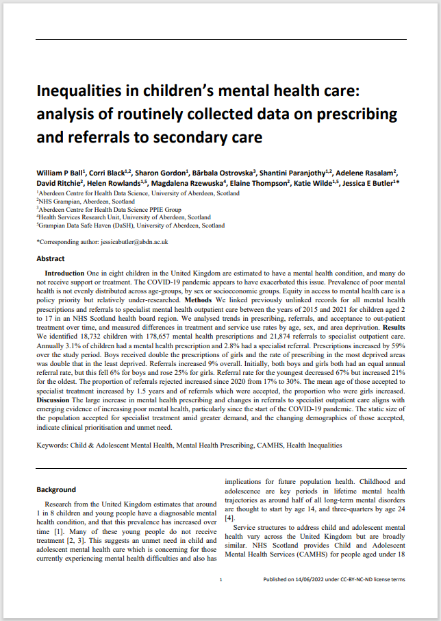

# Inequalities in childrens' mental health care: analysis of routinely collected data on prescribing and referrals to secondary care

## Introduction 

This repository contains supplementary materials related to the preprint which can be found here: https://www.medrxiv.org/content/10.1101/2022.06.14.22276082v3. Here we provide additional information about this work as well as summary data and the code used to analyse and produce the tables and plots in this published work.

The paper present results of an analysis of mental health prescribing and referrals to specialist Child and Adolescent Mental Health Services (CAMHS) for children in the NHS Grampian health board region (North East Scotland). This research was undertaken as part of the [Networked Data Lab project](https://www.health.org.uk/funding-and-partnerships/our-partnerships/the-networked-data-lab) which is funded by the [Health Foundation](https://www.health.org.uk/)

## Contents

In this repository you will find the following documents:

- Script files used to produce summary tables and plots of prescribing and referrals data
- Aggregated summary data files released from the [Grampian Data Safe Haven (DaSH)](https://www.abdn.ac.uk/iahs/facilities/grampian-data-safe-haven.php)
- [A table](https://github.com/AbdnCHDS/NDL_prescribing_referrals_paper/blob/main/Supporting%20material%20Table%20S1.%20GRIPP2-SF%20for%20CYPMH.pdf) which reports the detailed public involvement activities which informed and helped shape this project, following the GRIPP2-SF guidelines
- [A credit taxonomy table](https://github.com/AbdnCHDS/NDL_prescribing_referrals_paper/blob/main/credit%20taxonomy.pdf) outlining the different contributions made to this project by the authors

## Authors

This repository is maintained by:

- Will Ball - [Website](http://wpball.com) | [Github](https://github.com/will-ball) | [Twitter](http://www.twitter.com/willball12)
- Jess Butler [Website](https://www.abdn.ac.uk/people/jessicabutler) | [Github](https://github.com/JessButler) | [Twitter](https://twitter.com/JessButler284)

Additional authors who contributed to the research (listed alphabetically):

- Corri Black - [Website](https://www.abdn.ac.uk/people/corri.black)
- Sharon Gordon - [Website](https://www.abdn.ac.uk/people/sharon.gordon)
- Barbala Ostrovska 
- Shantini Paranjothy - [Website](https://www.abdn.ac.uk/people/shantini.paranjothy)
- Adelene Rasalam 
- David Ritchie
- Helen Rowlands - [Website](https://www.abdn.ac.uk/people/helen.rowlands)
- Magdalena Rzewuska - [Website](https://www.abdn.ac.uk/people/magdalena.rzewuska)
- Elaine Thompson
- Katie Wilde - [Website](https://www.abdn.ac.uk/people/k.wilde)
